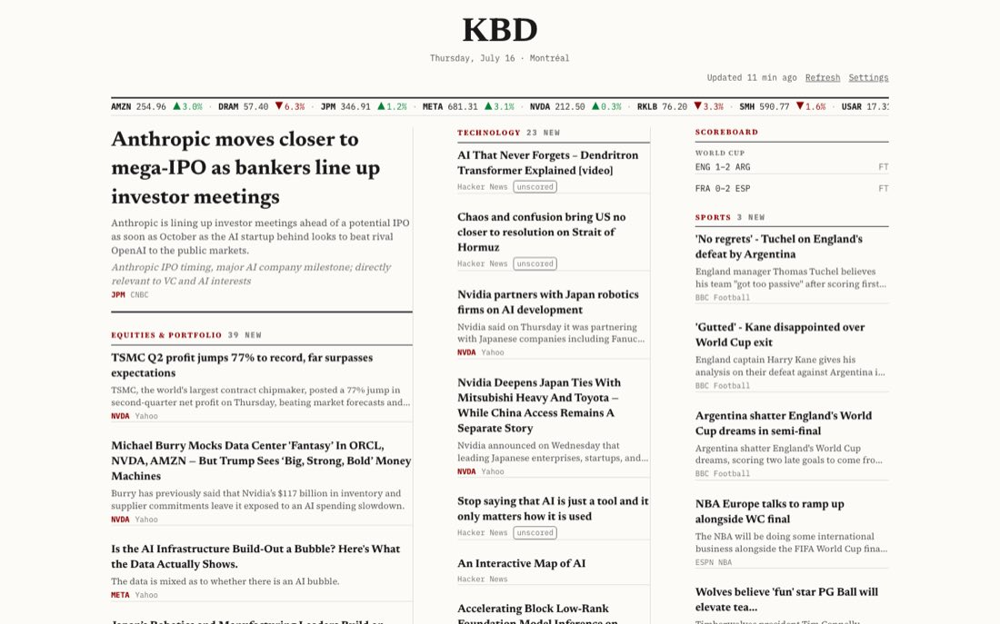

# Personalized Newspaper

[](https://web-production-ccca1.up.railway.app)

A single-user personalized broadsheet: it polls Finnhub, RSS feeds, and HackerNews on a schedule, scores every article for relevance and clickbait with Claude Haiku, and renders a dense three-column newspaper front page from Postgres.

**Live:** [web-production-ccca1.up.railway.app](https://web-production-ccca1.up.railway.app)



**Stack:** Next.js (App Router, TypeScript) + Tailwind v4 + Drizzle ORM/Postgres + node-cron, deployed as a single service on Railway.

Design and implementation details: `docs/superpowers/specs/2026-07-09-personalized-newspaper-design.md` (spec) and `docs/superpowers/plans/2026-07-09-personalized-newspaper.md` (plan).

## Architecture

```text
app/src/
├── app/                # Next.js App Router — front page, settings, unlock
│   └── api/            # articles, feeds, tickers, topics, settings, refresh
├── ingestion/
│   ├── fetchers/       # finnhub.ts · hackernews.ts · rss.ts
│   ├── curator.ts      # Claude Haiku relevance + clickbait scoring
│   ├── dedupe.ts       # cross-source dedupe
│   └── retention.ts    # old-article cleanup
├── scheduler.ts        # node-cron polling loop
├── db/                 # Drizzle ORM schema + queries (Postgres)
└── components/         # broadsheet layout components

app/tests/              # vitest suite against a separate test database
```

The page is publicly viewable; admin actions (settings, manual refresh) are gated behind `/unlock?key=<ADMIN_KEY>`, which sets an httpOnly cookie after a timing-safe key comparison.

## Local dev

```bash
cd app
docker compose up -d               # local Postgres on port 5433
cp .env.example .env                # fill in FINNHUB_API_KEY, ANTHROPIC_API_KEY
npm install
npm run db:push && npm run db:seed
npm run dev
```

`ENABLE_SCHEDULER=false` is recommended for dev. Instead of waiting on the poller, trigger ingestion manually with the Refresh button in the UI, or:

```bash
curl -X POST localhost:3000/api/refresh
```

## Tests

```bash
npm test
```

Tests run against a separate `newspaper_test` database, not your dev DB. First-time setup:

```bash
docker compose exec db psql -U newspaper -c "CREATE DATABASE newspaper_test;"
npm run db:push:test
```

## Railway deploy

1. Create a Railway project, add a **PostgreSQL** plugin.
2. Connect this repo as a service and set the service's **root directory to `app/`**.
3. Set environment variables on the service:
   - `DATABASE_URL` — reference the Postgres plugin's connection variable
   - `FINNHUB_API_KEY`
   - `ANTHROPIC_API_KEY`
   - `ENABLE_SCHEDULER` — optional, defaults on (`true`)
4. Deploy. Railway uses `app/railway.json`'s start command (`db:migrate` → `db:seed` → `start`); the seed is idempotent and safe to run on every deploy. First articles should appear within about a minute of boot (the scheduler runs an ingestion pass 10s after startup).

## Why I built this

I was tired of feeds optimized for engagement instead of for me. This is the inverse: I declare the tickers, topics, and sources I care about, an LLM grades every incoming article for relevance to *my* interests and penalizes clickbait, and the result is laid out like a print broadsheet — dense, finite, and done when you reach the bottom. It also turned out to be a nice exercise in running a scheduled ingestion pipeline, an LLM scoring stage, and a web frontend as one small deployable unit.
